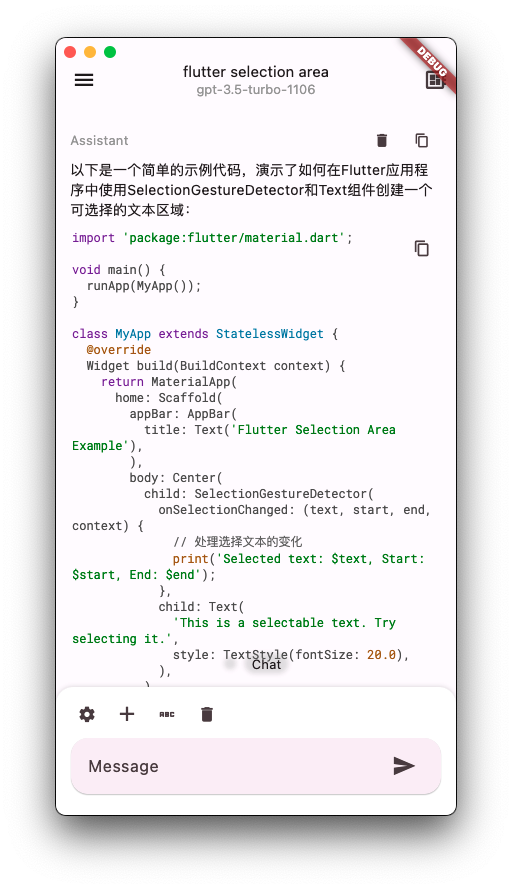
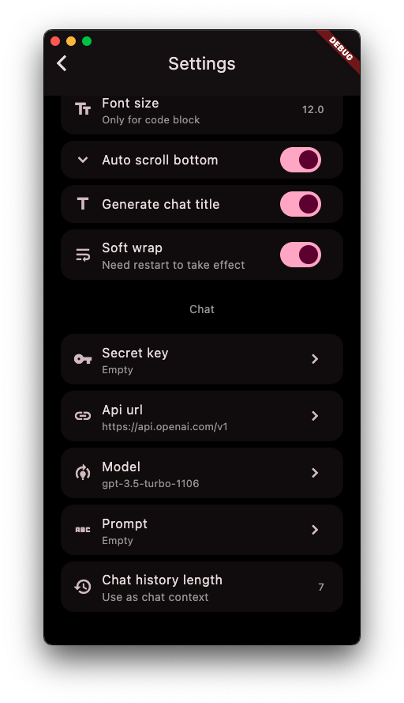
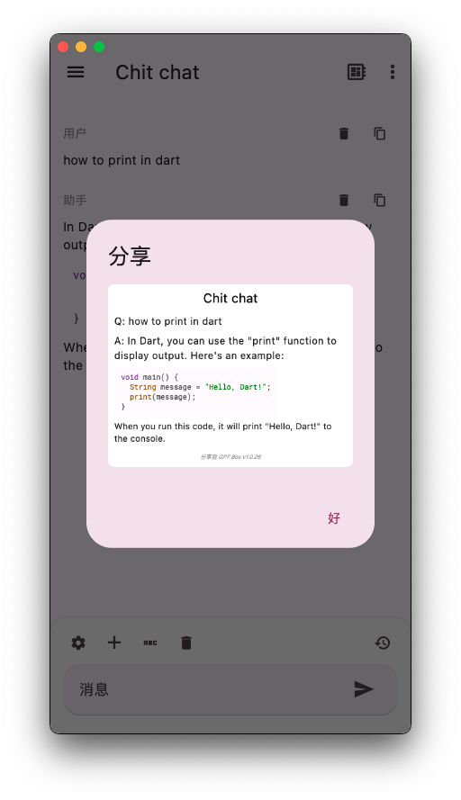

简体中文 | [English](README.md)

<h2 align="center">Flutter GPT Box</h2>

一个支持 OpenAI API 的 第三方全平台客户端。
 
<a href="https://gpt.lolli.tech/">尝试网页版</a> （推荐使用客户端以获得更好的性能）

<!-- Badges-->

  
  
  

## 😣 注意
本应用目前正在开发中，可能部分功能缺失 / 不可用。
请不要在生产环境中使用，也不要用于重要数据。

## 🪄 特性
- 从 [ChatGPT Next Web](https://github.com/ChatGPTNextWeb/ChatGPT-Next-Web) 恢复
- 文本 / 图片 / 音频聊天（网页版仅支持文本）
- 以图片形式分享聊天
- Uni-Link，例如：`lk-gptbox://chat/new?msg=你好` (Linux 除外)
- 与 WebDAV / iCloud 同步
- 全平台支持
- 渲染 代码块 / LaTeX 公式

## 🏙️ 截屏
<table>
  <tr>
    <td></td>
    <td></td>
    <td></td>
    <td></td>
  </tr>
</table>

## ⬇️ 使用
[iOS](https://apps.apple.com/app/id6476033062) / [Android](https://res.lolli.tech/gpt/latest.apk) / [macOS](https://apps.apple.com/app/id6476033062) / [Linux](https://res.lolli.tech/gpt/latest.AppImage) / [Windows](https://res.lolli.tech/gpt/latest.win.zip) / [Web](https://gpt.lolli.tech/)

- 由于中国政策原因，且**目前**无法完成[备案](https://github.com/lollipopkit/flutter_server_box/discussions/180)。请移步 AppStore 其他区下载。
- 关于安全：
  - 为了防止注入攻击等因素，请勿从不可信来源下载。
  - 由于 `Linux / Windows` 使用了默认签名，因此建议[自行构建](https://github.com/lollipopkit/flutter_server_box/wiki/%E4%B8%BB%E9%A1%B5#%E8%87%AA%E7%BC%96%E8%AF%91)。

## 🆘 帮助

- 吹水、参与开发、了解如何使用，QQ群 **762870488**

反馈前须知：
1. 反馈问题请附带 log（点击首页右上角），并以 bug 模版提交。
2. 反馈问题前请检查是否是 本app 的问题。
3. 欢迎所有有效、正面的反馈，主观（比如你觉得其他UI更好看）的反馈不一定会接受

确认了解上述内容后：
- 如果你有**任何问题或者功能请求**，请在 [讨论](https://github.com/lollipopkit/flutter_gpt_box/discussions/new/choose) 中交流。
- 如果 app 有**任何 bug**，请在 [问题](https://github.com/lollipopkit/flutter_gpt_box/issues/new) 中反馈。

## 🧱 贡献
- 任何正面的贡献都欢迎。
- [本地化翻译指南](https://blog.lolli.tech/faq/) 可在我的博客中找到。

## 💡 我的其它 Apps
- [Server Box](https://github.com/lollipopkit/flutter_server_box) - 服务器状态和工具。
- [2FA Box](https://github.com/lollipopkit/flutter_2fa) - 开源的 2FA 应用。
- [更多](https://github.com/lollipopkit) - 工具 & etc.

## 📝 协议
`GPL v3 lollipopkit`
