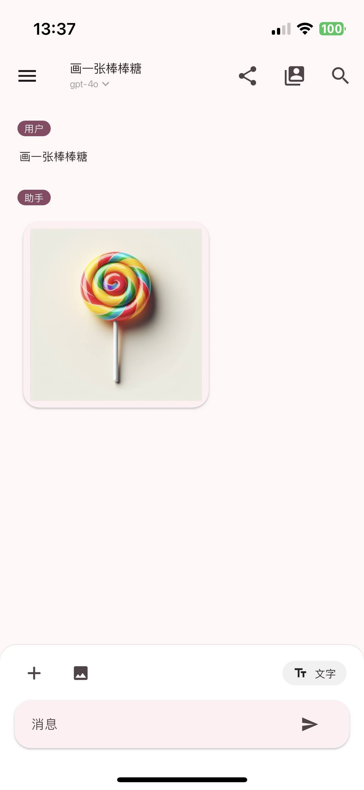
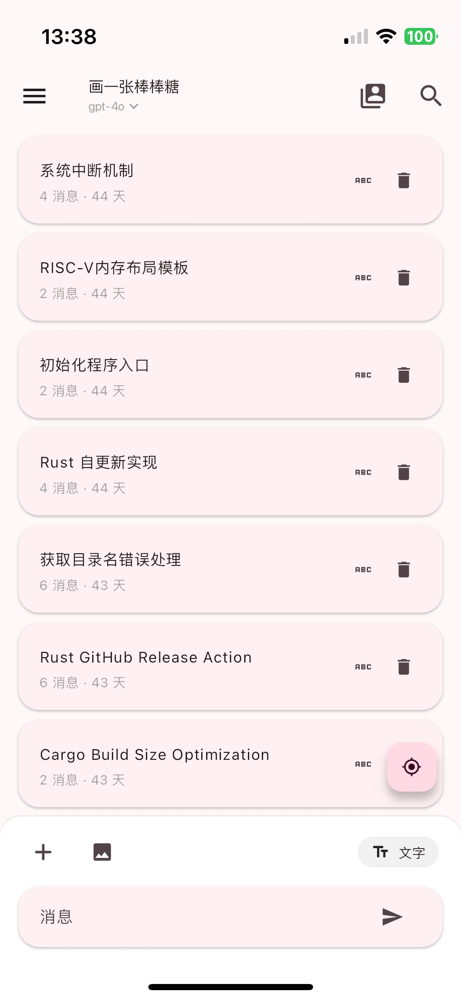
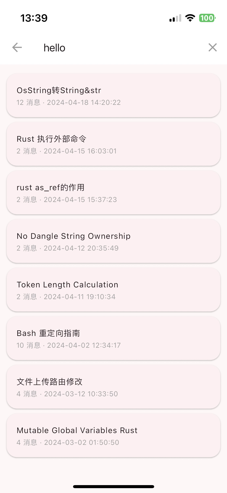
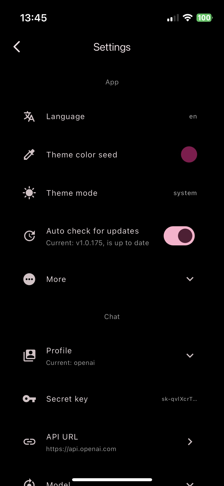

简体中文 | [English](README.md)

<h2 align="center">Flutter GPT Box</h2>

一个支持 OpenAI API 的 第三方客户端。

<!-- Badges-->

  
  

## 😣 注意
本应用目前正在开发中，可能部分功能缺失 / 不可用。
请不要在生产环境中使用，也不要用于重要数据。

## 🪄 特性
- (🥳 新) Api 支持查看 Http 链接的内容、(开发中)本地运行 JS 脚本
- 从 [ChatGPT Next Web 备份](https://github.com/ChatGPTNextWeb/ChatGPT-Next-Web) / [OpenAI导出文件](https://chatgpt.com) 恢复
- 文本 / 图片 / 音频聊天
- 本地化（简体中文 / English）
- 以图片形式分享聊天
- Url Scheme，例如：`lk-gptbox://chat/new?msg=你好`
- 与 WebDAV / iCloud 同步
- 移动端 & 桌面端 支持
- 渲染 代码块 / LaTeX 公式

## 🏙️ 截屏
<table>
  <tr>
    <td></td>
    <td></td>
    <td></td>
    <td></td>
  </tr>
</table>

## ⬇️ 使用
🎉 **现在 `Android / Linux / Windows` 版本使用 GitHub Actions 构建**。

[iOS & macOS](https://apps.apple.com/app/id6476033062) / [Android & Linux & Windows](https://github.com/lollipopkit/flutter_gpt_box/releases)

- 所有已弃用的包 (< `v1.0.183`) 可以在[这里](https://cdn.lolli.tech/gptbox/?sort=time&order=desc&layout=grid)找到。
- 由于中国政策原因，且**目前**无法完成备案。请移步 AppStore 其他区下载。
- 为了防止注入攻击等因素，请勿从不可信来源下载。

## 🆘 帮助

- 吹水、参与开发、了解如何使用，QQ群 **762870488**

反馈前须知：
1. 反馈问题请附带 log（点击首页右上角），并以 bug 模版提交。
2. 反馈问题前请检查是否是 本app 的问题。
3. 欢迎所有有效、正面的反馈，主观（比如你觉得其他UI更好看）的反馈不一定会接受

确认了解上述内容后：
- 如果你有**任何问题或者功能请求**，请在 [讨论](https://github.com/lollipopkit/flutter_gpt_box/discussions/new/choose) 中交流。
- 如果 app 有**任何 bug**，请在 [问题](https://github.com/lollipopkit/flutter_gpt_box/issues/new) 中反馈。

## 🧱 贡献
- 任何正面的贡献都欢迎。
- [本地化翻译指南](https://blog.lolli.tech/faq/) 可在我的博客中找到。

## 💡 我的其它 Apps
- [Server Box](https://github.com/lollipopkit/flutter_server_box) - 服务器状态和工具。
- [2FA Box](https://github.com/lollipopkit/flutter_2fa) - 开源的 2FA 应用。
- [更多](https://github.com/lollipopkit) - 工具 & etc.

## 📝 协议
`GPL v3 lollipopkit`
